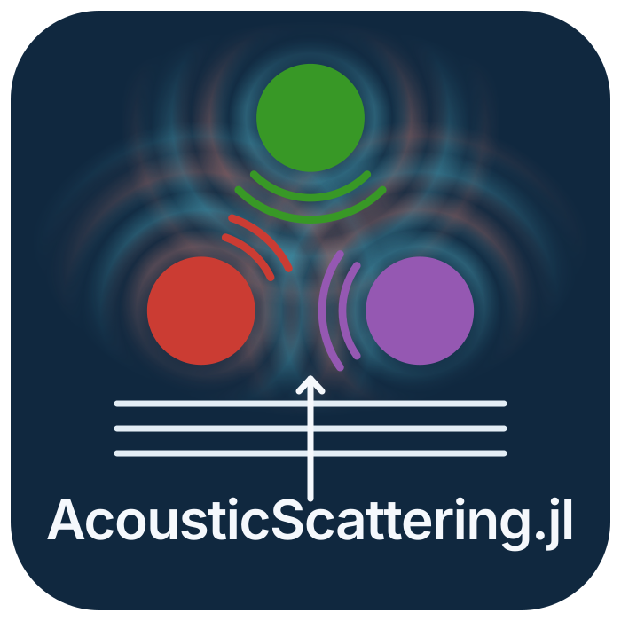

<p align="center">
  
</p>

# AcousticScattering.jl

AcousticScattering.jl models how individual objects scatter sound in a fluid. It provides
modal-series and Kirchhoff models, boundary-element and finite-element methods, and the
method of fundamental solutions for calculating scattering amplitude and target strength.

Supported geometries include spheres, spheroids, straight and bent cylinders, and shells.
Material options include rigid, pressure-release, fluid-filled, and elastic configurations.
Support varies by solver. See the [model guide](docs/src/models/selection.md) for available
combinations and limitations.

## Installation

Requires Julia 1.10 or later, CMake, and a Fortran toolchain. See the
[build prerequisites](docs/src/getting_started/index.md#build-prerequisites) for details.
Install the development version from GitHub:

```julia
import Pkg
Pkg.add(url = "https://github.com/brandynlucca/AcousticScattering.jl")
```

Installation runs an optional precompile workload to reduce first-call latency.
[Getting Started](docs/src/getting_started/index.md#opt-out-before-the-first-precompile)
explains how to disable it before installation.

## Example

Calculate backscatter target strength for a rigid sphere with a 1 cm radius at 38 kHz:

```julia
using AcousticScattering

frequency = 38000.0 # Hz
sound_speed = 1477.4 # m/s
wavenumber = 2pi * frequency / sound_speed

solution = modal(Sphere(0.01), Rigid(), wavenumber)
target_strength(solution) # approximately -49.09 dB re 1 m²
```

## Documentation

- [Getting Started](docs/src/getting_started/index.md): installation and your first calculation.
- [First frequency sweep](docs/src/tutorials/index.md): plot target strength and save the data.
- [Models and theory](docs/src/models/index.md): conventions, assumptions, and solver selection.
- [API reference](docs/src/api.md): geometry, materials, solvers, and result queries.
- [Visualization gallery](docs/src/gallery/index.md): figures with links to their examples.

## Citation

If you use this package in research, cite the software and record the version or commit used:

> Lucca, B., and contributors. *AcousticScattering.jl* [Computer software].
> https://github.com/brandynlucca/AcousticScattering.jl

Please also cite the relevant model papers listed in the
[documentation references](docs/src/models/references.md).

## License

[MIT](LICENSE) for the package. The [logo artwork](docs/src/assets/LICENSE) incorporates
Julia's dots and is licensed separately under CC BY-NC-SA 4.0.
