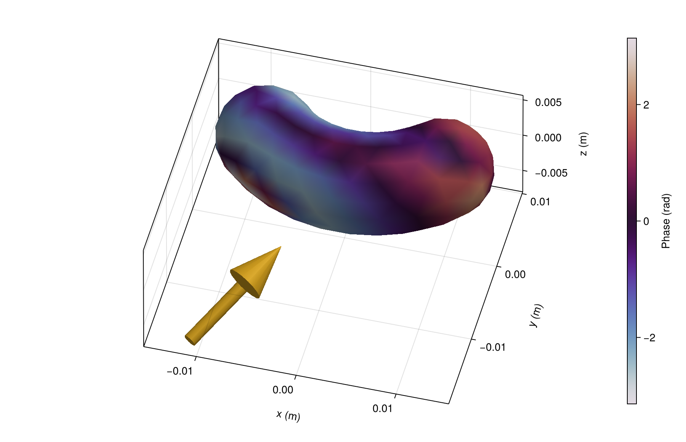
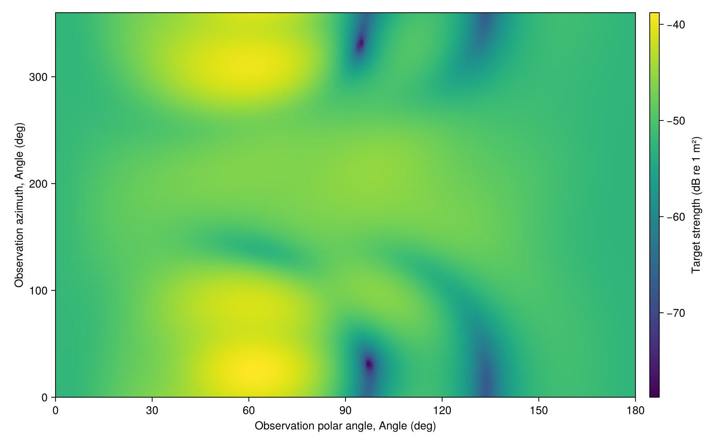
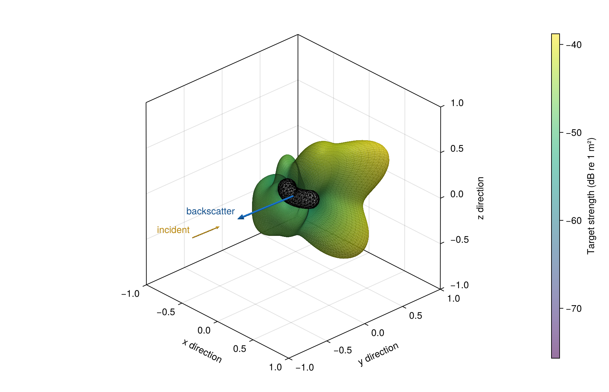

# [Surface phase and directional scattering](@id gallery-bent)

Solve a closed rigid body with curved sides and rounded ends. Its bend lies in the xy plane. Its midpoint tangent is +x. These compact mesh settings are for visualization.

```@example gallery_bent
using AcousticScattering
using CairoMakie: Axis3, Colorbar, plot, surface, save

body = Cylinder(0.005, 0.02; radius_curvature=0.02, endcap_depth=0.005)
surface_mesh = mesh(body; method=:full, resolution=0.0032, mesh_order=3, qorder=4)
solution = bem(surface_mesh, Rigid(), 100.0; incidence_angle=pi / 3, incidence_azimuth=0.4)
nothing # hide
```

## [Phase on the surface](@id gallery-field)

Color shows scattered-pressure phase. The cyclic palette joins −π and π.

```@example gallery_bent
fig = plot(solution; kind=:surface_field, field=:pressure_phase,
    colorrange=(-pi, pi), colormap=:twilight,
    figure=(size=(760, 480), figure_padding=(70, 20, 20, 20)),
    axis=(xlabel="x (m)", ylabel="y (m)", zlabel="z (m)", zlabeloffset=70))
Colorbar(fig.figure[1, 2]; limits=(-pi, pi), colormap=:twilight, label="Phase (rad)")
save("phase.png", fig)
nothing # hide
```



## [All observation directions](@id gallery-map)

Keep incidence fixed and sweep observation polar angle and azimuth.

```@example gallery_bent
fig = plot(solution; kind=:bistatic_map,
    thetas=range(0, pi; length=61), phis=range(0, 2pi; length=121),
    colorrange=(-80, -50), colormap=:viridis, figure=(size=(760, 480),))
Colorbar(fig.figure[1, 2]; limits=(-80, -50), colormap=:viridis,
    label="Target strength (dB re 1 m²)")
save("map.png", fig)
nothing # hide
```



## [3D scattering lobes](@id gallery-radiation)

Radius is far-field amplitude magnitude divided by its maximum. Color is directional target strength in dB re 1 m². This is a radiation pattern, not the body's physical surface. The direction opposite the incident wave gives the backscattering strength.

```@example gallery_bent
pattern = bistatic_map(solution, range(0, pi; length=61), range(0, 2pi; length=121))
r = 10 .^ ((pattern.target_strength .- maximum(pattern.target_strength)) ./ 20)
x = r .* cos.(pattern.thetas)
y = r .* sin.(pattern.thetas) .* cos.(pattern.phis')
z = r .* sin.(pattern.thetas) .* sin.(pattern.phis')
fig = surface(x, y, z; color=pattern.target_strength, colormap=:viridis,
    figure=(size=(760, 480), figure_padding=(70, 20, 20, 20)),
    axis=(type=Axis3, aspect=:data, xlabel="x", ylabel="y", zlabel="z"))
Colorbar(fig.figure[1, 2], fig.plot; label="Target strength (dB re 1 m²)")
save("radiation.png", fig)
nothing # hide
```



The [bent-cylinder tutorial](@ref bent-cylinder-tutorial) checks mesh and quadrature refinement and adds frequency and incidence sweeps.
