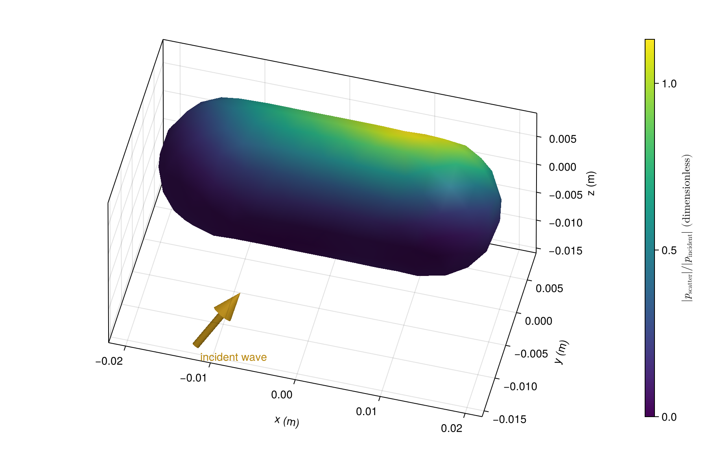

# [Pressure on a closed fluid cylinder](@id gallery-capped)

A fluid-filled cylinder has hemispherical ends and oblique incidence. Full-surface BEM includes both ends. Color shows scattered-pressure magnitude, normalized by incident amplitude.

```@example gallery_capped
using AcousticScattering
using CairoMakie: Colorbar, plot, save

body = Cylinder(0.008, 0.024; endcap_depth=0.008)
surface_mesh = mesh(body; method=:full, resolution=0.005, mesh_order=3, qorder=4)
solution = bem(surface_mesh, FluidFilled(1.5, 0.8), 150.0;
    incidence_angle=pi / 3, incidence_azimuth=pi / 4)
fig = plot(solution; kind=:surface_field, field=:pressure_magnitude,
    colormap=:viridis, figure=(size=(800, 520), figure_padding=(70, 20, 20, 20)),
    axis=(xlabel="x (m)", ylabel="y (m)", zlabel="z (m)", zlabeloffset=70))
Colorbar(fig.figure[1, 2], first(fig.plot.plots); label="Scattered pressure / incident amplitude")
save("capped_pressure.png", fig)
nothing # hide
```



The cylinder's long axis is x. Mesh size and quadrature order should be refined for quantitative comparisons.

