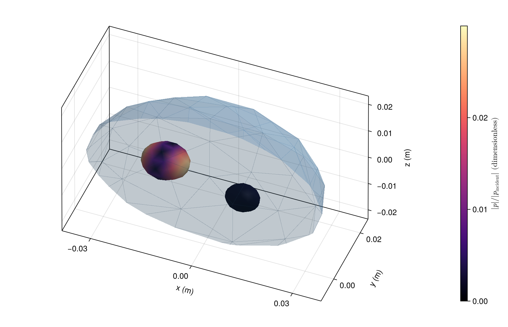

# [Two gas cavities in one body](@id gallery-cavities)

A branched region tree places both cavities inside the same outer body, `parents=[0, 1, 1]`. Their different sizes and positions produce different coupled internal pressures. The complete outer mesh has alpha 0.5.

```@example gallery_cavities
using AcousticScattering
using CairoMakie: plot, plot!, save

surfaces = [
    mesh(; semiaxes=(0.035, 0.025, 0.022), resolution=0.7, qorder=4),
    mesh(; semiaxes=(0.007, 0.006, 0.005), center=(-0.013, 0.004, 0), resolution=0.7, qorder=4),
    mesh(; semiaxes=(0.005, 0.004, 0.004), center=(0.013, -0.004, 0.002), resolution=0.7, qorder=4)]
materials = [FluidFilled(1.04, 1.04), GasFilled(0.0012, 0.23), GasFilled(0.0012, 0.23)]
solution = bem(surfaces, materials, 20.0; parents=[0, 1, 1], incidence_angle=pi / 3)
fig = plot(solution; kind=:surface_field, interfaces=[2, 3], colormap=:viridis,
    figure=(size=(800, 520),))
plot!(fig.axis, solution; kind=:mesh, interfaces=[1], wireframe_interfaces=[1],
    interface_colors=[(:steelblue, 0.5)])
save("cavity_pressure.png", fig)
nothing # hide
```



Color shows total pressure magnitude divided by incident amplitude. This is one illustrative frequency. A resonance study needs frequency and mesh refinement.

