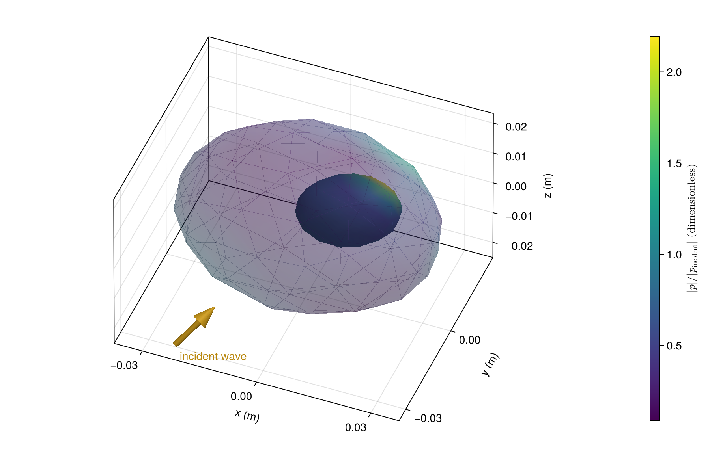

# [An off-center fluid inclusion](@id gallery-eccentric)

A displaced dense inclusion breaks spherical symmetry. Color shows total pressure on the
inclusion; the complete outer interface remains visible as a translucent grid.

```@example gallery_eccentric
using AcousticScattering
using CairoMakie: plot, plot!, save

surfaces = [
    mesh(; semiaxes=(0.028, 0.028, 0.028), resolution=0.7, qorder=4),
    mesh(; semiaxes=(0.012, 0.010, 0.009), center=(0.008, 0.004, 0.002), resolution=0.7, qorder=4)]
solution = bem(surfaces, [FluidFilled(1.05, 0.98), FluidFilled(1.8, 0.7)], 250.0;
    parents=[0, 1], incidence_angle=pi / 3)
fig = plot(solution; kind=:surface_field, interfaces=[2], colormap=:viridis,
    figure=(size=(800, 520),))
plot!(fig.axis, solution; kind=:mesh, interfaces=[1], wireframe_interfaces=[1],
    interface_colors=[(:steelblue, 0.5)])
save("eccentric_pressure.png", fig)
nothing # hide
```



Materials use density and sound-speed ratios relative to the exterior. These mesh settings
are for visualization; see [numerical convergence](@ref convergence-tutorial) for refinement.

