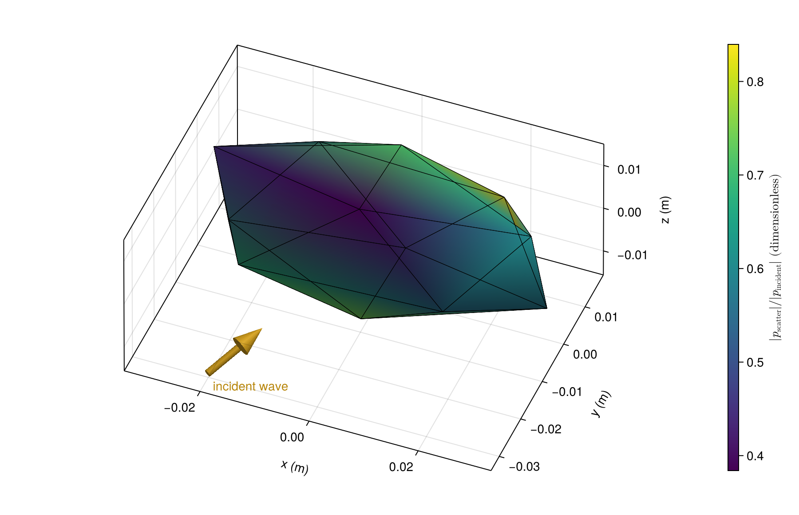

# [A supplied faceted body](@id gallery-faceted)

Supply vertices and outward-oriented triangles directly. This rigid octahedron is
elongated along x; color shows scattered-pressure magnitude divided by incident amplitude.

```@example gallery_faceted
using AcousticScattering
using CairoMakie: Colorbar, plot, save

nodes = [0.025 -0.025 0 0 0 0; 0 0 0.016 -0.016 0 0; 0 0 0 0 0.012 -0.012]
triangles = [1 3 2 4 3 2 4 1; 3 2 4 1 1 3 2 4; 5 5 5 5 6 6 6 6]
surface_mesh = mesh(nodes, triangles; qorder=7)
solution = bem(surface_mesh, Rigid(), 150.0; incidence_angle=pi / 3, incidence_azimuth=0.4)
fig = plot(solution; kind=:surface_field, field=:pressure_magnitude, show_edges=true,
    colormap=:viridis,
    figure=(size=(800, 520), figure_padding=(70, 20, 20, 20)),
    axis=(xlabel="x (m)", ylabel="y (m)", zlabel="z (m)", zlabeloffset=70))
Colorbar(fig.figure[1, 2], first(fig.plot.plots); label="Scattered pressure / incident amplitude")
save("faceted_pressure.png", fig)
nothing # hide
```



This small mesh demonstrates the input and plotting workflow. Sharp-edge pressure
requires local refinement for quantitative accuracy.
