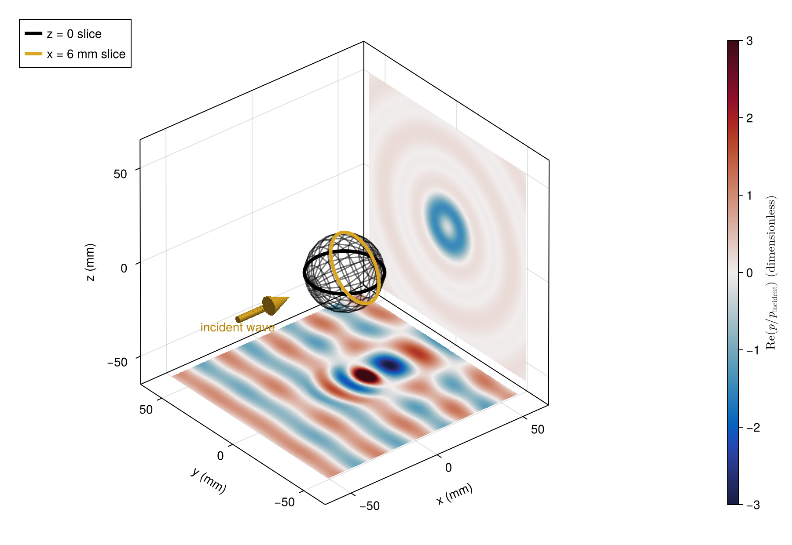

# [Pressure-field slices in 3D](@id gallery-field-slices)

Two intersecting slices reveal the transmitted and scattered field of a fluid sphere.
The wave travels along +x; color shows the real part of total pressure divided by
incident amplitude. The downstream slice is at x = 25 mm.

```@example gallery_field_slices
using AcousticScattering
using CairoMakie: Figure, Axis3, Colorbar, surface!, wireframe!, save

radius = 0.018
solution = modal(Sphere(radius), FluidFilled(2.0, 0.65), 250.0)
grid = range(-0.055, 0.055; length=101)
a, b = [u for u in grid, v in grid], [v for u in grid, v in grid]
p = pressure(solution, [(x, y, 0.0) for x in grid, y in grid])
q = pressure(solution, [(0.025, y, z) for y in grid, z in grid])
fig = Figure(size=(800, 560))
ax = Axis3(fig[1, 1]; aspect=:data, xlabel="x (mm)", ylabel="y (mm)", zlabel="z (mm)")
slice = surface!(ax, 1000a, 1000b, zeros(size(a)); color=real.(p),
    colormap=:balance, colorrange=(-3, 3), shading=false)
surface!(ax, fill(25.0, size(a)), 1000a, 1000b; color=real.(q),
    colormap=:balance, colorrange=(-3, 3), shading=false)
theta, phi = range(0, pi; length=17), range(0, 2pi; length=33)
wireframe!(ax, 1000radius .* [cos(t) for t in theta, f in phi],
    1000radius .* [sin(t)*cos(f) for t in theta, f in phi],
    1000radius .* [sin(t)*sin(f) for t in theta, f in phi]; color=(:black, 0.35))
Colorbar(fig[1, 2], slice; label="Real pressure / incident amplitude")
save("field_slices.png", fig)
nothing # hide
```



