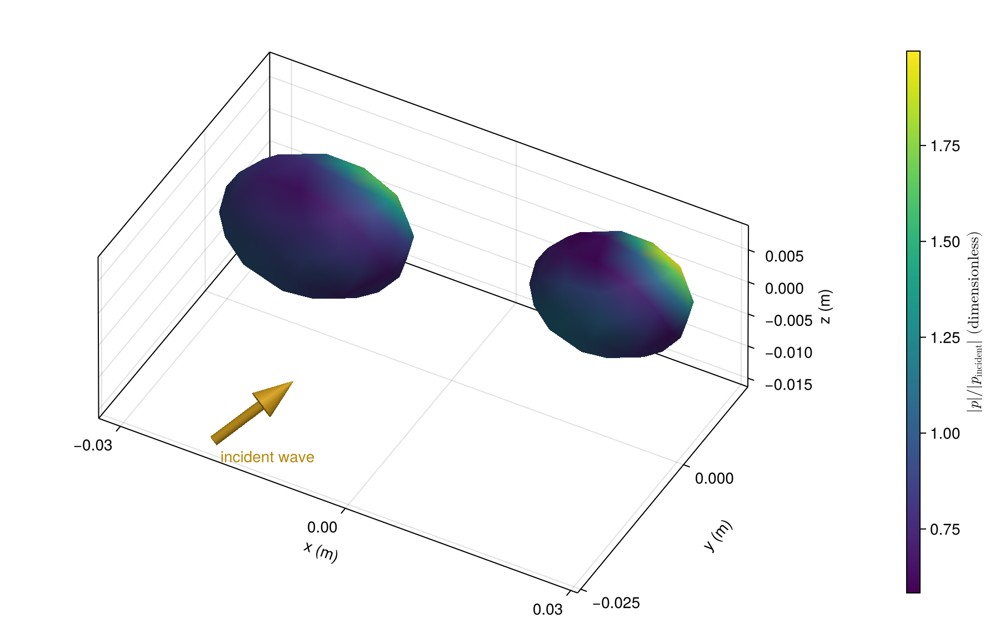
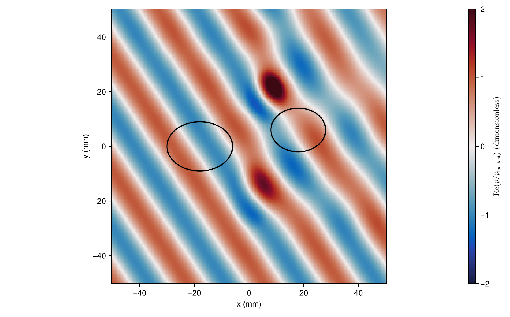
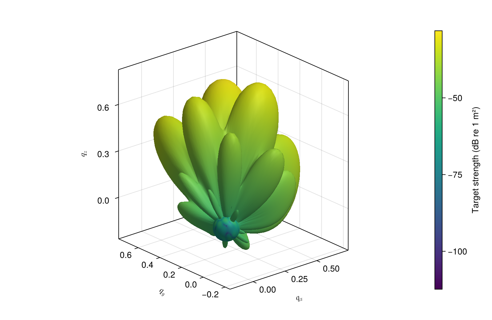

# [Interacting particles](@id gallery-interacting)

## [Multiple scattering between two particles](@id gallery-pair)

Two nearby fluid particles share one coupled solve, so the pressure driving either surface
already includes the field reradiated by the other. Both are exterior-facing regions
(`parents=[0, 0]`). The oblique view keeps their facing surfaces visible, where that mutual
loading is easiest to compare. The gold arrow marks the incident wave direction.

```@example gallery_pair
using AcousticScattering
using CairoMakie: Axis, DataAspect, Colorbar, @L_str, heatmap!, lines!, plot, save, Figure

surfaces = [
    mesh(; semiaxes=(0.012, 0.009, 0.008), center=(-0.018, 0, 0),
        resolution=0.5, qorder=4),
    mesh(; semiaxes=(0.010, 0.008, 0.007), center=(0.018, 0.006, 0),
        resolution=0.5, qorder=4)]
materials = [FluidFilled(1.4, 0.8), FluidFilled(1.8, 0.7)]
solution = bem(surfaces, materials, 300.0; parents=[0, 0],
    incidence_angle=pi / 3, incidence_azimuth=pi / 6)
fig = plot(solution; kind=:surface_field, field=:pressure_magnitude,
    colormap=:viridis, incident_arrow=true, figure=(size=(900, 580),),
    axis=(azimuth=-0.34pi, elevation=0.23pi, xlabel="x (m)",
        ylabel="y (m)", zlabel="z (m)"))
save("pair_pressure.png", fig)
nothing # hide
```



Both particles have a lower sound speed than the surrounding fluid, so each focuses the wave onto its
exit side, as an isolated sphere of the same material does. A slice through z = 0 shows the field
inside and around both particles.

```@example gallery_pair
grid = range(-0.05, 0.05; length=201)
p = pressure(solution, [(x, y, 0.0) for x in grid, y in grid])
fig = Figure(size=(900, 560))
ax = Axis(fig[1, 1]; aspect=DataAspect(), xlabel="x (mm)", ylabel="y (mm)")
hm = heatmap!(ax, 1000grid, 1000grid, real.(p)'; colormap=:balance, colorrange=(-2, 2))
theta = range(0, 2pi; length=201)
lines!(ax, 1000 .* (-0.018 .+ 0.012 .* cos.(theta)), 1000 .* (0.009 .* sin.(theta));
    color=:black, linewidth=2)
lines!(ax, 1000 .* (0.018 .+ 0.010 .* cos.(theta)), 1000 .* (0.006 .+ 0.008 .* sin.(theta));
    color=:black, linewidth=2)
Colorbar(fig[1, 2], hm; label=L"\mathrm{Re}(p / p_\mathrm{incident})~(\mathrm{dimensionless})")
save("pair_slice.png", fig)
nothing # hide
```



## [Phase across a three-body cluster](@id gallery-cluster)

Use three differently sized particles with oblique incidence. The returned solution includes multiple scattering among all three bodies.

```@example gallery_cluster
using AcousticScattering
using CairoMakie: Axis3, Colorbar, @L_str, plot, surface, save

surfaces = [
    mesh(; semiaxes=(0.011, 0.008, 0.007), center=(-0.020, -0.012, 0), resolution=0.5, qorder=4),
    mesh(; semiaxes=(0.010, 0.007, 0.006), center=(0.016, -0.010, 0.006), resolution=0.5, qorder=4),
    mesh(; semiaxes=(0.009, 0.007, 0.006), center=(0, 0.020, -0.005), resolution=0.5, qorder=4)]
solution = bem(surfaces, fill(FluidFilled(1.5, 0.8), 3), 400.0;
    parents=[0, 0, 0], incidence_angle=pi / 3, incidence_azimuth=pi / 4)
fig = plot(solution; kind=:surface_field, field=:pressure_phase,
    colormap=:twilight, colorrange=(-pi, pi), incident_arrow=true,
    figure=(size=(900, 580), figure_padding=(70, 20, 55, 20)),
    axis=(azimuth=-0.35pi, elevation=0.24pi, xlabel="x (m)",
        ylabel="y (m)", zlabel="z (m)"))
save("cluster_phase.png", fig)
nothing # hide
```


## [The cluster's 3D scattering pattern](@id gallery-cluster-radiation)

Reuse that solution for every observation direction. Radius maps the upper 25 dB of response
onto 0.08 to 1.0 so secondary lobes remain visible. Color is unmodified target strength. This
is a directional pattern, not a physical surface, so the axes $q_x$, $q_y$, $q_z$ are direction components
scaled by that radius. The small central sphere is the 0.08 radius floor, where the response is more
than 25 dB below the peak. Backscatter is opposite the incident wave.

```@example gallery_cluster
pattern = bistatic_map(solution, range(0, pi; length=91), range(0, 2pi; length=181))
peak = maximum(pattern.target_strength)
r = 0.08 .+ 0.92 .* clamp.((pattern.target_strength .- peak .+ 25) ./ 25, 0, 1)
x = r .* cos.(pattern.thetas)
y = r .* sin.(pattern.thetas) .* cos.(pattern.phis')
z = r .* sin.(pattern.thetas) .* sin.(pattern.phis')
fig = surface(x, y, z; color=pattern.target_strength, colormap=:viridis,
    figure=(size=(800, 520), figure_padding=(70, 20, 20, 20)),
    axis=(type=Axis3, aspect=:data, xlabel=L"q_x", ylabel=L"q_y", zlabel=L"q_z"))
Colorbar(fig.figure[1, 2], fig.plot; label="Target strength (dB re 1 m²)")
save("cluster_radiation.png", fig)
nothing # hide
```



Mesh settings are compact visualization choices. Refine meshes and quadrature before using these values quantitatively.
