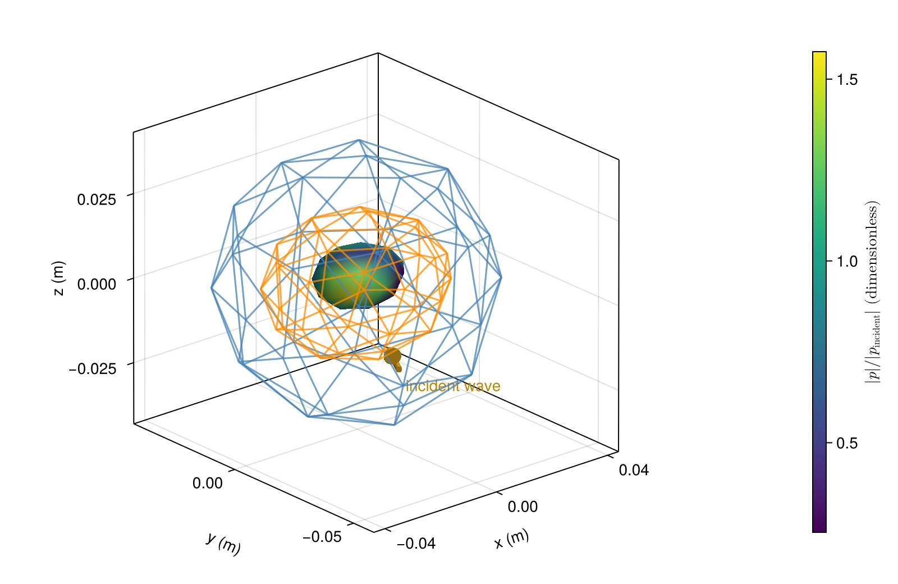

# [Three nested fluid regions](@id gallery-layers)

Nested regions need not share a center or shape. Here a spherical exterior interface
contains a flattened middle region and an offset core. Color shows pressure on the core;
translucent grids retain both enclosing interfaces.

```@example gallery_layers
using AcousticScattering
using CairoMakie: plot, plot!, save

surfaces = [
    mesh(; semiaxes=(0.040, 0.040, 0.040), resolution=0.7, qorder=4),
    mesh(; semiaxes=(0.028, 0.024, 0.021), resolution=0.7, qorder=4),
    mesh(; semiaxes=(0.014, 0.011, 0.009), center=(0.004, 0.004, 0), resolution=0.7, qorder=4)]
materials = [FluidFilled(1.1, 0.95), FluidFilled(1.4, 1.15), FluidFilled(1.8, 0.75)]
solution = bem(surfaces, materials, 180.0; parents=[0, 1, 2], incidence_angle=pi / 3)
fig = plot(solution; kind=:surface_field, interfaces=[3], colormap=:viridis,
    figure=(size=(800, 520),))
plot!(fig.axis, solution; kind=:mesh, interfaces=[1, 2], wireframe_interfaces=[1, 2],
    interface_colors=[(:steelblue, 0.5), (:darkorange, 0.5)])
save("layered_pressure.png", fig)
nothing # hide
```



Pressure is normalized by incident amplitude. Refine these visualization meshes before
interpreting fine spatial features.

