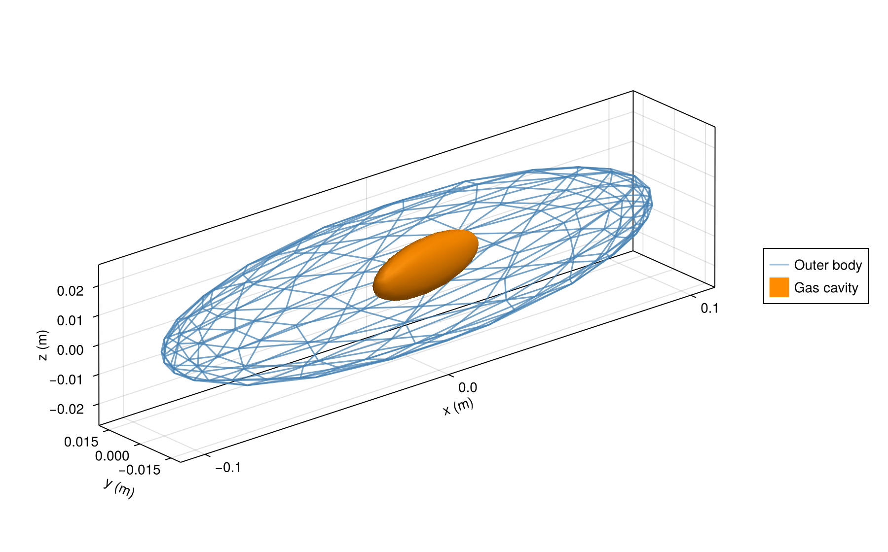
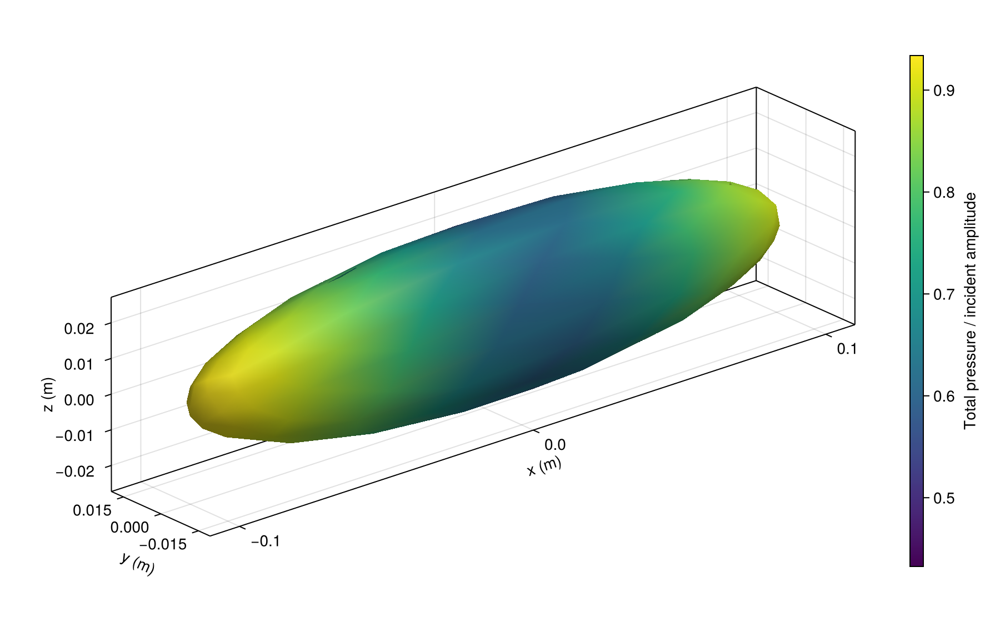

# [See inside a coupled body](@id gallery-nested)

A complete translucent outer mesh reveals an offset gas-filled interior. The long axis is x, width is y, and height is z. These are illustrative shapes and visualization meshes.

```@example gallery_nested
using AcousticScattering
using CairoMakie: plot, save

surfaces = [
    mesh(; semiaxes=(0.10, 0.018, 0.025), resolution=0.5, tip_ratio=0.4, qorder=5),
    mesh(; semiaxes=(0.025, 0.006, 0.009), center=(0.01, 0.003, 0.0),
        rotation=(axis=(0, 0, 1), angle=deg2rad(10)), resolution=0.5, tip_ratio=0.4, qorder=5)]
solution = bem(surfaces, [FluidFilled(1.04, 1.04), GasFilled(0.00129, 0.23)],
    2pi * 2250 / 1477.4; parents=[0, 1], incidence_angle=pi / 2)
fig = plot(solution; kind=:mesh, wireframe_interfaces=[1],
    interface_colors=[(:steelblue, 0.5), :darkorange],
    interface_labels=["Outer body", "Gas cavity"],
    figure=(size=(900, 560), figure_padding=(70, 20, 20, 20)),
    axis=(xlabel="x (m)", ylabel="y (m)", zlabel="z (m)"))
save("nested.png", fig)
nothing # hide
```



Use `target_strength(solution)` for the coupled response. The [fish tutorial](@ref fish-tutorial) compares coupled and isolated components and checks refinement.

## [Pressure on the outer body](@id gallery-surface-pressure)

Color the complete outer surface by total pressure magnitude, normalized by incident amplitude.
This includes the gas cavity's contribution to the coupled field.

```@example gallery_nested
fig = plot(solution; kind=:surface_field, interfaces=[1], field=:pressure_magnitude,
    colormap=:viridis, figure=(size=(900, 560), figure_padding=(70, 20, 20, 20)))
save("nested_pressure.png", fig)
nothing # hide
```


