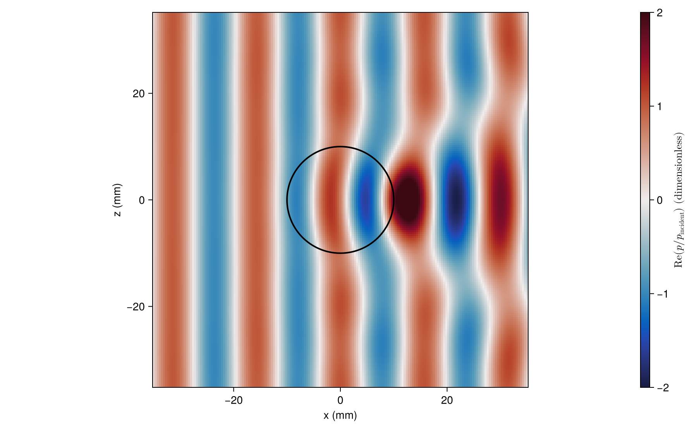

# [Pressure inside and around a particle](@id gallery-pressure)

A plane wave travels along +x through a fluid particle. Color shows the dimensionless real part
of total pressure normalized by incident amplitude. The circle marks the interface.

```@example gallery_pressure
using AcousticScattering
using CairoMakie: Figure, Axis, DataAspect, Colorbar, @L_str, heatmap!, lines!, save

solution = modal(Sphere(0.01), FluidFilled(1.3, 0.8), 400.0)
x = range(-0.035, 0.035; length=181)
p = pressure(solution, [(a, 0.0, b) for a in x, b in x])
fig = Figure(size=(900, 560))
ax = Axis(fig[1, 1]; aspect=DataAspect(), xlabel="x (mm)", ylabel="z (mm)")
hm = heatmap!(ax, 1000x, 1000x, real.(p); colormap=:balance, colorrange=(-2, 2))
theta = range(0, 2pi; length=201)
lines!(ax, 10cos.(theta), 10sin.(theta); color=:black, linewidth=2)
Colorbar(fig[1, 2], hm; label=L"\mathrm{Re}(p / p_\mathrm{incident})~(\mathrm{dimensionless})")
save("pressure.png", fig)
nothing # hide
```



Change the density and sound-speed ratios in `FluidFilled` to explore refraction and interference.
