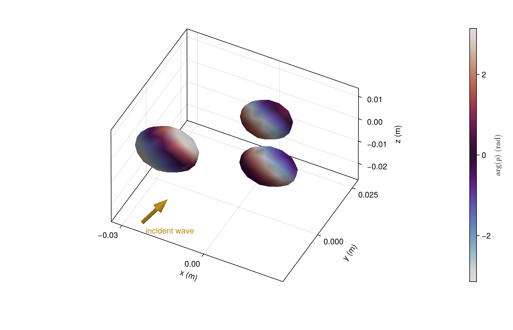

# [Visualization Gallery](@id gallery)

Explore geometry, materials, coupled bodies, pressure fields and scattering patterns.
Click any figure to enlarge it, or open its short, runnable Julia example.

```@raw html
<div class="scattering-gallery">
  <figure>
    <a href="examples/nested.png" aria-label="Enlarge see inside a coupled body">
      
    </a>
    <figcaption>
      <h2>See inside a coupled body</h2>
      <p>A complete translucent mesh reveals an offset gas cavity.</p>
```

[Short example](@ref gallery-nested)

```@raw html
    </figcaption>
  </figure>
```

```@raw html
  <figure>
    <a href="examples/nested_pressure.png" aria-label="Enlarge pressure on a coupled body">
      
    </a>
    <figcaption>
      <h2>Pressure on a coupled body</h2>
      <p>Total pressure on the outer surface includes the cavity's influence.</p>
```

[Short example](@ref gallery-surface-pressure)

```@raw html
    </figcaption>
  </figure>
```

```@raw html
  <figure>
    <a href="examples/cluster_phase.png" aria-label="Enlarge multiple scattering">
      
    </a>
    <figcaption>
      <h2>Multiple scattering</h2>
      <p>Pressure phase across three interacting particles under oblique incidence.</p>
```

[Short example](@ref gallery-cluster)

```@raw html
    </figcaption>
  </figure>
```

```@raw html
  <figure>
    <a href="examples/faceted_pressure.png" aria-label="Enlarge bring your own mesh">
      
    </a>
    <figcaption>
      <h2>Bring your own mesh</h2>
      <p>Scattered-pressure magnitude on a supplied faceted body.</p>
```

[Short example](@ref gallery-faceted)

```@raw html
    </figcaption>
  </figure>
```

```@raw html
  <figure>
    <a href="examples/cavity_pressure.png" aria-label="Enlarge two internal gas cavities">
      
    </a>
    <figcaption>
      <h2>Two internal gas cavities</h2>
      <p>Different cavities share one enclosing body and one coupled solution.</p>
```

[Short example](@ref gallery-cavities)

```@raw html
    </figcaption>
  </figure>
```

```@raw html
  <figure>
    <a href="examples/layered_pressure.png" aria-label="Enlarge nested fluid regions">
      
    </a>
    <figcaption>
      <h2>Nested fluid regions</h2>
      <p>Inspect an offset core through two complete enclosing interfaces.</p>
```

[Short example](@ref gallery-layers)

```@raw html
    </figcaption>
  </figure>
```

```@raw html
  <figure>
    <a href="examples/eccentric_pressure.png" aria-label="Enlarge an off-center inclusion">
      
    </a>
    <figcaption>
      <h2>An off-center inclusion</h2>
      <p>Pressure on a displaced inclusion inside a spherical body.</p>
```

[Short example](@ref gallery-eccentric)

```@raw html
    </figcaption>
  </figure>
```

```@raw html
  <figure>
    <a href="examples/field_slices.png" aria-label="Enlarge pressure fields in 3d">
      
    </a>
    <figcaption>
      <h2>Pressure fields in 3D</h2>
      <p>Intersecting slices reveal transmitted and scattered waves.</p>
```

[Short example](@ref gallery-field-slices)

```@raw html
    </figcaption>
  </figure>
```

```@raw html
  <figure>
    <a href="examples/phase.png" aria-label="Enlarge phase on a curved body">
      
    </a>
    <figcaption>
      <h2>Phase on a curved body</h2>
      <p>A closed bent surface, colored by scattered-pressure phase.</p>
```

[Short example](@ref gallery-field)

```@raw html
    </figcaption>
  </figure>
```

```@raw html
  <figure>
    <a href="examples/capped_pressure.png" aria-label="Enlarge closed fluid cylinders">
      
    </a>
    <figcaption>
      <h2>Closed fluid cylinders</h2>
      <p>Surface pressure at oblique incidence, including rounded ends.</p>
```

[Short example](@ref gallery-capped)

```@raw html
    </figcaption>
  </figure>
```

```@raw html
  <figure>
    <a href="examples/radiation.png" aria-label="Enlarge 3d scattering lobes">
      
    </a>
    <figcaption>
      <h2>3D scattering lobes</h2>
      <p>Radius shows relative amplitude; color shows directional target strength.</p>
```

[Short example](@ref gallery-radiation)

```@raw html
    </figcaption>
  </figure>
```

```@raw html
  <figure>
    <a href="examples/map.png" aria-label="Enlarge every observation direction">
      
    </a>
    <figcaption>
      <h2>Every observation direction</h2>
      <p>A single solution becomes a complete angular scattering map.</p>
```

[Short example](@ref gallery-map)

```@raw html
    </figcaption>
  </figure>
```

```@raw html
  <figure>
    <a href="examples/pressure.png" aria-label="Enlarge inside and around a particle">
      
    </a>
    <figcaption>
      <h2>Inside and around a particle</h2>
      <p>See transmitted waves and exterior interference in one slice.</p>
```

[Short example](@ref gallery-pressure)

```@raw html
    </figcaption>
  </figure>
```

```@raw html
  <figure>
    <a href="examples/bubble.png" aria-label="Enlarge bubble resonance">
      
    </a>
    <figcaption>
      <h2>Bubble resonance</h2>
      <p>Track a gas bubble's resonance in target strength and phase.</p>
```

[Short example](@ref gallery-bubble)

```@raw html
    </figcaption>
  </figure>
```

```@raw html
  <figure>
    <a href="examples/coating.png" aria-label="Enlarge add a coating">
      
    </a>
    <figcaption>
      <h2>Add a coating</h2>
      <p>Keep the core fixed and explore what its surrounding layer changes.</p>
```

[Short example](@ref gallery-coating)

```@raw html
    </figcaption>
  </figure>
```

```@raw html
  <figure>
    <a href="examples/elastic.png" aria-label="Enlarge elastic resonances">
      
    </a>
    <figcaption>
      <h2>Elastic resonances</h2>
      <p>Rigid and elastic spheres reveal very different spectra.</p>
```

[Short example](@ref gallery-elastic)

```@raw html
    </figcaption>
  </figure>
</div>
```
