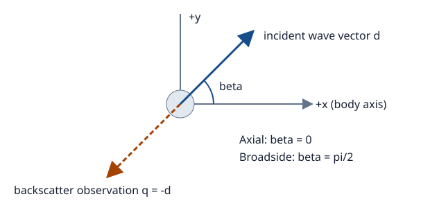

# [Conventions](@id conventions)

This section defines the equations, units, and directions used throughout the examples.
Choose a method using [Choosing a solver](@ref solver-selection), then read its theory page.
Equations below describe the implemented conventions. They are not a claim that every solver
can produce every field or observation direction.

## Harmonic acoustic problem

In a homogeneous exterior fluid, pressure satisfies

```math
\nabla^2 p + k^2 p = 0, \qquad
k = \frac{2\pi f}{c}, \qquad p = p_{\mathrm{inc}} + p_{\mathrm{scat}}.
```

Here frequency is in Hz, sound speed in m/s, and wavenumber in rad/m. The outgoing kernel
`exp(im * k * r) / (4pi * r)` used by the numerical solvers implies the time convention
`exp(-im * omega * t)`. This sign convention is inferred from the implementation. The
incident plane wave is `exp(im * k * dot(direction, position))`.

The outgoing pressure at large radius has scattering amplitude of dimension length:

```math
p_{\mathrm{scat}}(r\hat{\boldsymbol q})
\sim f_s(\hat{\boldsymbol q})\frac{e^{ikr}}{r}.
```

The sphere modal implementation uses
`-im / k * sum((2l + 1) * P_l(cos(angle)) * A_l)`.
Compare complex values only after matching phase, incident direction, and normalization.

## Target strength

```math
\sigma_{\mathrm{bs}} = |f_s(-\hat{\boldsymbol d})|^2,
\qquad
\mathrm{TS} = 10\log_{10}\left(\frac{\sigma_{\mathrm{bs}}}{1\,\mathrm{m}^2}\right)
= 20\log_{10}\left(\frac{|f_s|}{1\,\mathrm m}\right).
```

The package's backscattering cross-section convention has no additional `4pi` factor.
`target_strength` also evaluates directional scattering strength for bistatic observations.
These values describe backscatter only when the observation is opposite incidence.
Zero amplitude maps to `-Inf` dB. If a display clips small values, label that clipping.
Keep the underlying numerical result unchanged.

```jldoctest
julia> using AcousticScattering

julia> target_strength(0.01 + 0im)
-40.0
```

## Incidence and observation are different

| Input | Meaning |
|:--|:--|
| `incidence_angle` | Polar angle of the incident direction relative to the body axis |
| `incidence_azimuth` | Azimuth supported by the full 3D BEM path |
| `angle`, `azimuth` on axisymmetric BEM/MFS results | Observation direction in fixed body coordinates |
| `direction` on full BEM results | Observation unit vector in Cartesian coordinates |
| `angle` on sphere `modal` | Scattering angle relative to the incident axis |

Ordinary axisymmetric geometry uses z as its axis:



Arrows indicate direction vectors, not positions of transmitter and receiver. The incident
wave propagates along `d`, and monostatic observation is along `-d`.

```math
\hat{\boldsymbol d} =
(\sin\beta\cos\alpha,\sin\beta\sin\alpha,\cos\beta),
\qquad
\hat{\boldsymbol q}_{\mathrm{bs}}=-\hat{\boldsymbol d}.
```

Thus axial incidence has `beta = 0`, while broadside has `beta = pi / 2`.
For incidence in the x–z plane, axisymmetric backscatter requires observation
`angle = pi - beta, azimuth = pi`. Its default `angle = pi, azimuth = 0`
only gives backscatter for axial incidence. Full BEM's default observation and bent-cylinder
MFS's result already use the negative incident direction.

The bent-cylinder implementation uses its own bend-plane convention,
`direction = (cos(beta), 0, sin(beta))`. Do not transfer Cartesian vectors between that
implementation and a z-axis body without transforming coordinates.
