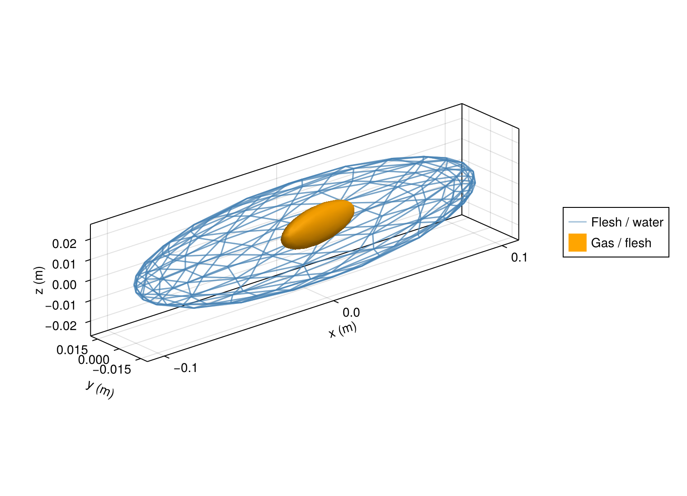
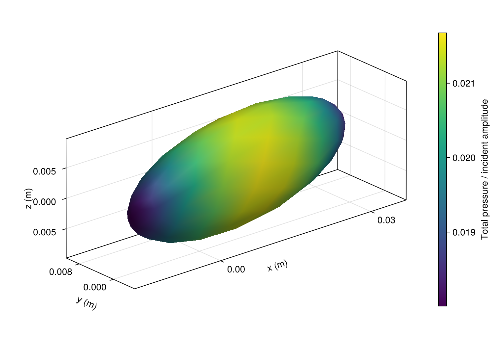
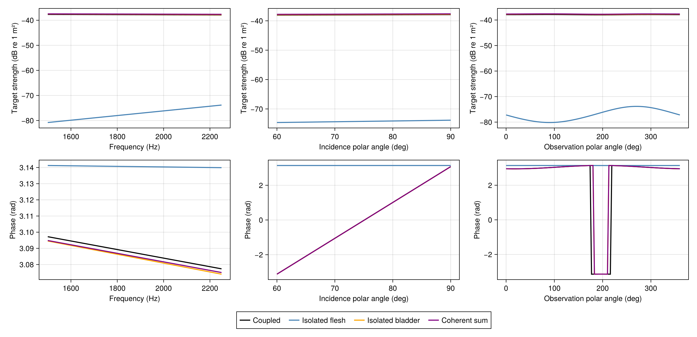

# [A synthetic fish and swimbladder](@id fish-tutorial)

Model a finless body and a displaced, tilted gas bladder as two nested ellipsoids.
This is a synthetic geometry, with no segmentation or smoothing and no measured specimen.

| Surface | Semiaxes `(x,y,z)` in metres | Centre in metres | Rotation about `+z` |
|:--|:--|:--|:--|
| Flesh | `(0.100,0.018,0.025)` | `(0,0,0)` | 0° |
| Bladder | `(0.025,0.006,0.009)` | `(0.010,0.003,0)` | 10° |

Water has sound speed 1477.4 m/s and density 1026.8 kg/m³. Flesh/water density and
sound-speed ratios are both 1.04; gas/water ratios are 0.00129 and 0.23. These
material values follow Table 1 of [Gonzalez et al. (2020)](https://doi.org/10.1016/j.jsv.2020.115609).
All media are homogeneous, lossless fluids; the bladder wall has no elastic stiffness.

## Construct and solve

```@example fish
using AcousticScattering
using CairoMakie: plot, save

function fish_surfaces(; resolution=0.4, qorder=5)
    options = (; resolution, qorder, tip_ratio=0.4)
    return [mesh(; semiaxes=(0.100,0.018,0.025), options...),
        mesh(; semiaxes=(0.025,0.006,0.009), center=(0.010,0.003,0),
            rotation=(axis=(0,0,1), angle=deg2rad(10)), options...)]
end

surfaces = fish_surfaces()
materials = [FluidFilled(1.04,1.04), GasFilled(0.00129,0.23)]
sound_speed = 1477.4
k = 2pi * 2250 / sound_speed
solution = bem(surfaces, materials, k; parents=[0,1], incidence_angle=pi/2)
target_strength(solution)
```

Region 0 is exterior water, region 1 flesh and region 2 gas. `parents=[0,1]` places
flesh in water and gas in flesh. All material contrasts refer to exterior water.
Incidence is along `+y`, broadside to the long `x` axis; `z` measures height/depth.

`mesh` generates cubic triangles by default. `resolution` is the dimensionless edge
size on the unit sphere before stretching; `tip_ratio=0.4` refines its local x poles.
Physical edge sizes depend on stretching. `qorder` controls quadrature independently.

## View geometry and pressure

```@example fish
geometry = plot(solution; kind=:mesh,
    wireframe_interfaces=[1], interface_colors=[(:steelblue,0.5), :orange],
    interface_labels=["Flesh / water", "Gas / flesh"])
pressure = plot(solution; kind=:surface_field, interfaces=[2])
save("fish_geometry.png", geometry)
save("fish_pressure.png", pressure)
nothing # hide
```





The complete flesh surface is drawn as a mesh grid with alpha 0.5, so the bladder
remains visible inside its body envelope. `interfaces=[2]` selects
the bladder; omit it for all interfaces. `field=:pressure_phase`, `:pressure_real`
and `:pressure_imag` select other pressure views. The colourbar is automatic.

These displays use corner triangles and vertex-averaged complex pressure; the solve
retains curved elements and quadrature-node traces. Phase is taken after complex averaging.

## Compare coupled and isolated responses

`components(solution)` reuses the coupled solution and solves each interface alone
in exterior water, preserving its position, material, incidence and phase origin.
The coherent sum adds the isolated **complex amplitudes**, omitting their mutual
interactions. Adding target strengths in dB would lose phase.

```@example fish
compare(k; beta=pi/2) = components(
    bem(surfaces, materials, k; parents=[0,1], incidence_angle=beta);
    labels=["flesh", "bladder"])

spectrum = frequency_sweep(compare, [1500.0,2250.0,3000.0], sound_speed)
aspect = incidence_angle_sweep(surfaces, materials, k, deg2rad.([60,90,120]);
    parents=[0,1], components=true, labels=["flesh", "bladder"])
pattern = bistatic_sweep(components(solution; labels=["flesh", "bladder"]),
    range(0,2pi; length=121))
comparison = plot(spectrum, aspect, pattern)
save("fish_comparison.png", comparison)
nothing # hide
```



Each sweep stores `amplitudes`, `target_strength` and `labels`. Rows are samples;
columns are coupled, isolated flesh, isolated bladder and coherent sum. Single-model
sweeps instead contain vectors. Plot saved results with `plot(spectrum; quantity=:phase)`
or `:target_strength`, `:magnitude`, `:real` or `:imag` without solving again.

The mesh-based incidence sweep assembles and factorizes each fixed-frequency system
once for all angles. It samples the coupled and isolated systems separately to limit
matrix storage; only the resulting amplitudes and strengths are retained.

Frequency and incidence sweeps measure backscatter, opposite each incident direction.
Incidence polar angles are measured from `+x` with azimuth zero. The observation cut
holds incidence along `+y` and sweeps the `xy` plane from `+x` toward `+y`: 90° is
forward and 270° backward.

Amplitudes are metres for a unit incident plane wave, using a common origin and
`exp(-im*omega*t)`. Phase is wrapped to `[-pi,pi]`; endpoint jumps are wrapping.
Use `angle(a/b)` for a phase difference between amplitudes.

## Check numerical convergence

For the 500 Hz gas-inclusion case, check the transmission solution with independent
mesh and quadrature refinements:

```@example fish
low = bem(fish_surfaces(), materials, 2pi * 500 / sound_speed; parents = [0, 1])
target_strength(low)
```

The default Müller formulation combines pressure and normal-derivative equations.
An explicit `formulation=:cbie` selects pressure equations alone; these conventional
equations can have fictitious eigenfrequencies. A successful check at one frequency
does not establish accuracy through resonance. See [Boundary methods](@ref boundary-theory)
for formulation choices.

Three frequency samples do not resolve the bladder's low-frequency resonance.
A resonance study needs its own frequency sampling and independent mesh/quadrature
refinement. The settings above establish neither resonance accuracy nor a bound at
all observation angles.

For example, compare a finer mesh at the same frequency and incidence:

```@example fish
refined = bem(fish_surfaces(; resolution=0.36), materials, k; parents=[0,1])
a, b = scattering_amplitude(solution), scattering_amplitude(refined)
(; change_db=abs(target_strength(a)-target_strength(b)),
    relative_amplitude_change=abs(a-b)/abs(b))
```

Repeat with `fish_surfaces(; qorder=7)` to refine quadrature independently, and at
each frequency, incidence and observation direction of interest. Require changes
below 0.1 dB **and** 1% complex amplitude for this example. Check the isolated
solutions too when interpreting small component differences, and sample near
scattering nulls. Run dense refinements sequentially; allow at least 16 GB RAM.

These changes measure numerical convergence, not physical-model error. A measured
fish calculation also needs both registered surfaces, units, segmentation and
smoothing records. Synthetic ellipsoids cannot recover the published CT anatomy.
